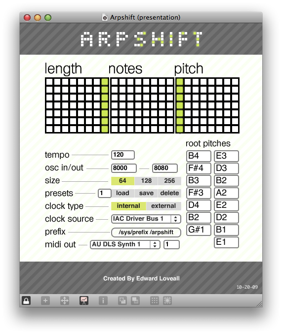
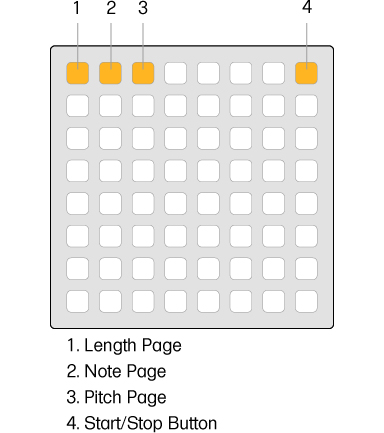

# arpshift

A melodic, interval based, poly-rhythmic arpeggiator.

**Created by**: [Edward Loveall](https://github.com/edwardloveall)

## Quick Start Tutorial

  - Open MonomeSerial
  - Open ArpShift
  - Push some buttons
  - Hit the button in the top left of the monome
  - Also fool around with the top right buttons that switch to different pages
  - Make amazing music and show the world

## In Depth Explanation

### monome interface

- When you open ArpShift, you'll see 3 buttons in top left that are lit up. One of them is blinking. There is also be a button on the top right of the monome that is solid. The 3 to the left are for switching among the app's pages and the button on the right is for start and stop.

- This is a sequencer; however, it's not like normal sequencers. Think of each row (except for the top row) as completely separate. The rows do not interact with each other, nor must they have the same values. For example, the first row can be a phrase of 7, and the second row can be a phrase of 3. The only thing that relates the rows, is the master clock.

- Aprshift has 3 pages. A length page, a note page and a pitch page. We'll start with button 2 on the diagram (the note page) first.

- The note page is just like any other arpeggiator. If you touch any of the bottom 7 rows, a note will appear. Hit the start button (top right) and you'll hear the notes. You can put as many notes down as you want. All notes trigger a midi note at 127 velocity. You can set which pitch to be triggered in the app it self.

- The length page (first page, button 1 on the diagram) is for controlling each row's length, i.e., how long until the row stars over. You'll see flashing lights going by and also solid lights to the right. The flashing lights indicate where in the timeline each row is. The solid light indicates how long each row's phrase is. Try changing the length of some rows. You'll notice that the pitches and general harmonic structure of the notes stay the same, but the rhythmic structure is ever-changing. This is one of the ways ArpShift is different from many other step sequencers.

 - Nerdy Math Side Note: If this wasn't a feature in ArpShift, it would repeat at maximum every 8 notes. At its most diverse settings, ArpShift can give you a pattern that is 40,320 (8!) notes long before it ever repeats verbatim. And that's only on the 64!

- The pitch page (third page, button 3 on the diagram) is used to change the harmonic structure of the performance. Each row starts out at its initial pitch offset all the way to the left. By pushing the buttons to the right, you change the pitch by half steps. Wouldn't it be nice to move the pitch down instead of up? Well you can actually. If you put your pitches 7 semitones (or 15 semitones if you're on a 128 or 256) lower than your intended starting pitch, you can have the pitch offset start all the way right and work down from there. You could even start it in the middle.

### max interface

- To change the tempo of ArpShift, click and drag on the tempo box to reflect a new tempo. The default is a random number between 80 and 150 (inclusive). This is so you don't feel stuck writing at 120 BPM always.

- If your Monome receives or sends data on an alternate port, you many change these ports in the osc in/out section of ArpShift.

- ArpShift should automatically detect the size of of your Monome. If for some reason it doesn't, or you would like to change the size of monome that ArpShift is acting on, click the size number you want.

- ArpShift can also manage sets of preset pitches, lengths and notes. To save a preset, pick a number for the preset then click save. If you want to load a preset, pick the number you'd like to recall then hit load. If you want to delete a preset, again, select a number, hit delete. Pretty simple.

- ArpShift may be synced to an external clock. Here are instructions for syncing to Ableton Live. To sync ArpShift to an external clock to Ableton Live, make a new midi track and set the output to a destination that ArpShift can receive. You can check for those devices in the Clock Source drop down menu. Also make sure Ableton is set to send sync data to that destination in its MIDI Sync preferences. Then in ArpShift, select the that MIDI destination from the Clock Source drop down menu and select External from the Clock Type option. Now when you hit play or stop in Ableton, it will start and stop ArpShift. You can see if ArpShift is using an external clock source by the Start/Stop button. It will flash slowly to indicate it's using an external clock as opposed to the more rapid flash for internal clock.
Note that when ArpShift is using External Synchronization, it uses 16th notes for its subdivision.

- The prefix of ArpShift is (unsurprisingly) /arpshift. If MonomeSerial is running when you start up ArpShift, it will be set automatically. If not, click the button labeled ( /sys/prefix /arpshift ).
Note that you may have to close and reopen ArpShift while MonomeSerial is open for the monome to display the correct LEDs.

- ArpShift generates MIDI note data. To send this data to an alternate source for sounds, choose a device from the MIDI Device dropdown menu. You can also change the MIDI Channel that ArpShift sends on.

## Media

http://vimeo.com/6770717

http://vimeo.com/6021893
